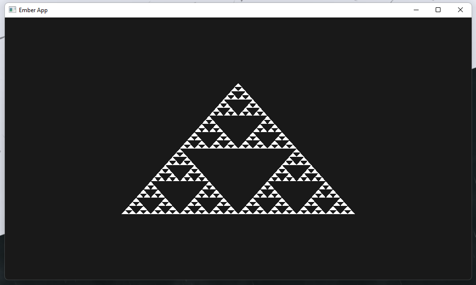
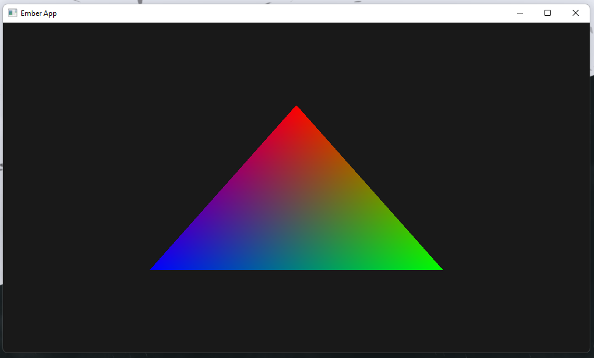

> Ember is a project with which I want to learn the basics of computer graphics, graphic pipelines and the vulkan graphics api itself.

> My goal is to build a 3D cellular automata app with the engine.

> Special thanks to @blurrypiano | [Brendan Galea](https://www.youtube.com/channel/UC9pXmjxsQHeFH9vgCeRsHcw) who made a tutorial which i follow step by step to learn more about vulkan

| Name  | Usage |
| ------------- | ------------- |
| C++  | core of the engine  |
| Vulkan  | renderer of the engine  |
| GLFW  | window library, makes the app plattform independent  |
| GLM  | math library  |

Sierpinski triangle       |  Triangle visualising barycentric coordinates
:-------------------------:|:-------------------------:
  |  
